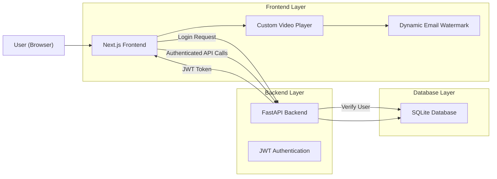

```mermaid
flowchart LR

User["User (Browser)"]

subgraph Frontend Layer
    FE["Next.js Frontend"]
    Player["Custom Video Player"]
    Watermark["Dynamic Email Watermark"]
end

subgraph Backend Layer
    API["FastAPI Backend"]
    Auth["JWT Authentication"]
end

subgraph Database Layer
    DB["SQLite Database"]
end

User --> FE
FE -->|Login Request| API
API -->|Verify User| DB
API -->|JWT Token| FE
FE --> Player
Player --> Watermark
FE -->|Authenticated API Calls| API
API --> DB
```
